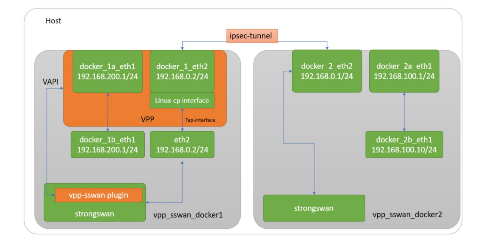

# vpp sswan

## 一. 简介

### 1.1 开源项目简介

sswan插件是intel提供的，[介绍如何在VPP中集成strongswan，以便同时享有`strongswan成熟的IKE机制`和`高性能的VPP IPsec`](https://builders.intel.com/solutionslibrary/fd-io-vpp-sswan-and-linux-cp-integrate-strongswan-with-world-s-first-open-sourced-1-89-tb-ipsec-solution-technology-guide)。

该文档称VPP的`IKEV2`插件并不是一个成熟的可商用的软件。所以使用strongswan完成控制面的密钥协商，通过VPP提供的LCP机制，将策略与SA同步到VPP中，实现IPsec业务。

> Fd.io VPP IPsec contains a mature , performant, and widely used IPsec implementation, however it is an incomplete IKEv2 implementation that is not production ready.

该插件目前已经合入VPP主线，位于`vpp/extras/strongswan/vpp_sswan`路径。

> The VPP-SSwan plugin is included in VPP from 22.10 release and works with StrongSwan 5.9.5 onwards.

### 1.2 目的

通过分析下它的实现方式，看是否能为我们系统提供一个控制面协议和VPP共存的成熟案例。

### 1.3 参考

## 二. sswan和LCP

本节介绍这两个插件是如何协作的。

### 2.1 LCP

Linux内核负责控制面（control plane），例如 ARP、IPv6 邻居发现、ping 等。

VPP则像硬件ASIC一样，提供高速的数据面（data plane）转发。

> 这里的 ASIC 是指 Application-Specific Integrated Circuit（专用集成电路）。在网络设备里，ASIC 通常就是交换机/路由器里的硬件转发芯片，用来高速转发报文。它和通用 CPU 相比，逻辑是固化的，功能单一但转发性能极高。

为了让 Linux 网络协议栈正常工作，被VPP接管的接口需要在内核中有一个tun/tap镜像。

Linux 会在镜像的 tap/tun 接口上收发报文。任何在这些 Linux 接口上进行的配置，也需要同步应用到 VPP 中对应的物理接口上。这个功能是由 "linux_nl" 插件 提供的。

### 2.2 sswan

为了把源自VPP管理的网络接口A接收到的`IKE Packet`传递给`StrongSwan`，创建了一个LCP实例——网络接口A的镜像接口a。他们拥有相同的`IP`地址。LCP会同步这两个接口中的配置和路由。当一个IKE数据包经过VPP管理的网络接口A时，它将把这个数据包路由到镜像接口a，通过linux的协议栈交由`StrongSwan`处理。如果SA协商完毕，`StrongSwan`将通过`sswan`插件，为VPP配置IPsec(SA和Policy)和路由。配置完成后，VPP将负责IPsec ESP 加密/解密，并将数据包转发到所需的端口。

